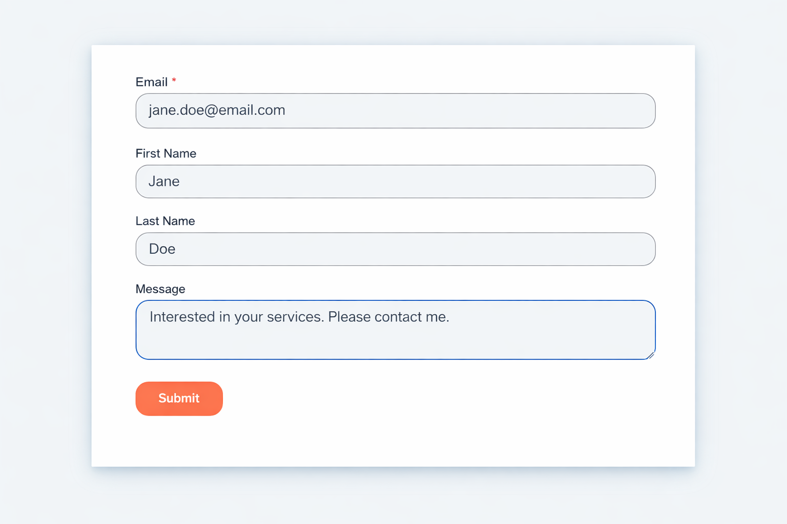
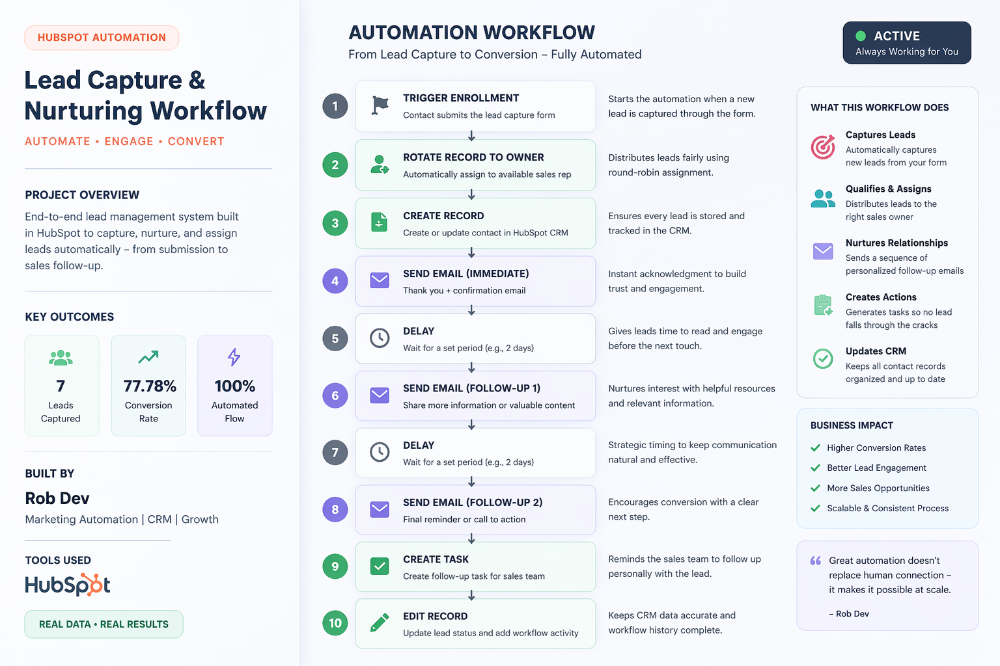
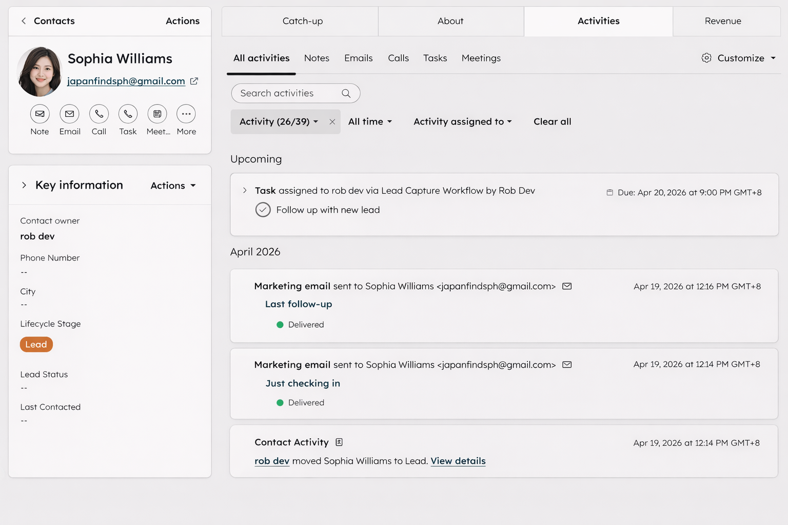

# 🚀 Lead Capture & Nurturing Workflow (HubSpot)

## 📌 Overview
This project demonstrates an end-to-end **lead capture and nurturing automation system** built using HubSpot.

It showcases how inbound leads can be automatically captured, nurtured, and transitioned to sales — eliminating manual work while improving response time and consistency.

---

## 💼 Business Scenario
This workflow simulates a **service-based business** (e.g., marketing agency, real estate, or consulting) that collects leads through a website form.

### Problem
- Leads are not followed up consistently  
- Manual assignment delays response time  
- Missed opportunities due to lack of tracking  

### Solution
This automation ensures that every lead is:
- Instantly captured  
- Automatically nurtured through email sequences  
- Assigned to the right sales owner  
- Tracked and updated inside the CRM  

---

## 🎯 Objective
To build a scalable workflow that:
- Captures leads from a form  
- Sends automated and timely follow-up emails  
- Assigns leads using round-robin distribution  
- Creates tasks for human follow-up  
- Maintains full visibility in the CRM  

---

## ⚙️ Workflow Summary
The automation follows a structured lifecycle:

1. Lead submits form (Trigger enrollment)  
2. Contact is automatically assigned to an owner (round-robin)  
3. Contact record is created/updated in CRM  
4. Immediate confirmation email is sent  
5. Delay (allow engagement)  
6. Follow-up email #1 is sent  
7. Delay  
8. Final follow-up email is sent  
9. Task is created for sales follow-up  
10. Contact record is updated  

---

## 📷 Lead Capture Form

Captures essential user information and triggers the automation workflow.

---

## 📷 Workflow Overview

Visual representation of the full automation process from lead capture to conversion.

---

## 📷 CRM Activity (Proof of Execution)

This demonstrates real workflow execution inside HubSpot:
- Automated emails successfully delivered  
- Contact lifecycle stage updates  
- Task creation for sales follow-up  
- Centralized activity tracking  

---

## 🧠 Key Decisions
- **3-email sequence** to balance engagement without overwhelming the lead  
- **2-day delays** to allow natural interaction timing  
- **Round-robin assignment** to evenly distribute leads among sales reps  
- **Task creation** to ensure human follow-up for higher conversion  

---

## 🎯 Key Features
- Automated lead capture from forms  
- Multi-step email nurturing sequence  
- Automated lead assignment  
- Task creation for sales teams  
- CRM record updates and activity tracking  
- Fully automated workflow (minimal manual intervention)  

---

## 📊 Results (Simulated Data)
- Instant response time after form submission  
- 100% of leads entered a structured follow-up sequence  
- Improved consistency in lead engagement  
- Reduced manual workload for sales teams  

---

## 🛠️ Tools Used
- HubSpot CRM  
- HubSpot Workflows  
- HubSpot Marketing Email  

---

## 🧠 Process Logic
This workflow is designed to:
- Engage leads immediately after submission  
- Maintain consistent communication through automation  
- Bridge the gap between marketing and sales  
- Provide full visibility into lead activity  

---

## ⚠️ Limitations
- No conditional branching based on email engagement  
- No lead scoring implemented  
- No external integrations (e.g., Slack notifications)  

---

## 🔄 Future Improvements
Potential enhancements include:
- Conditional logic (e.g., IF email opened or replied)  
- Lead scoring system for prioritization  
- Personalized email segmentation  
- A/B testing for email optimization  
- Real-time sales notifications  

---

## 👤 Built By
**Rob Dev**  
Marketing Automation | CRM | Growth  

---

## 💡 Note
This project uses demo/sample data for portfolio purposes.
